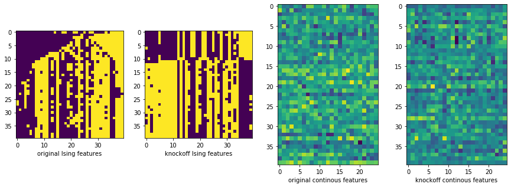
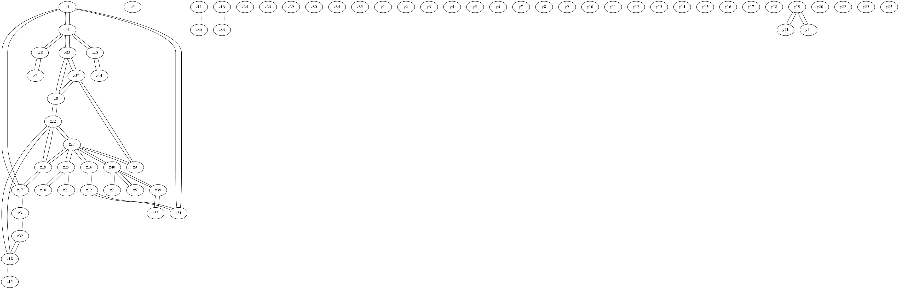

# Knockoff-Mixed-Graphical-Model
This is an algorithm for training a graphical model for associations between variables, some of which are qualitative and some quantitative.
The algorithm uses the model-X framework promoted by Candès et al. [https://arxiv.org/abs/1610.02351] which controls the proportion of falsely discovered edges,


## Installation
pip install git+https://github.com/toamto94/Knockoff-Mixed-Graphical-Model.git


## Example

#### Import libraries


```python
import os
import numpy as np
import pandas as pd
import matplotlib.pyplot as plt
from graphviz import Graph
from KnockoffMixedGraphicalModel import kmgm, isingutils
```


```python
os.environ["PATH"] += os.pathsep + "C:/Program Files (x86)/Graphviz2.38/bin/"
```

#### Load data


```python
Z = np.array(pd.read_csv("data\\Z.csv")) #discrete subvector
Y = np.array(pd.read_csv("data\\Y.csv")) #continous subvector
```

### For the sake of visualization, sample knockoffs for the conditional gaussian

#### Estimate coupling and joint coupling matrices


```python
coupling = np.cov(Z.T)
joint_coupling = isingutils.Ising_Data.joint_coupling(Z, Y)
```

#### Create instance of sampler


```python
conditional_gaussian_knockoff_sampler = kmgm.Ising_Normal_Knockoffs(Z, Y, coupling, joint_coupling)
```

#### Sample Knockoffs


```python
Z_tilde, Y_tilde = conditional_gaussian_knockoff_sampler.sample_knockoffs(k=2)
```

#### Visualize results


```python
fig, ax = plt.subplots(1, 4, figsize=(15, 5))
ax[0].imshow(Z)
ax[1].imshow(Z_tilde)
ax[2].imshow(Y)
ax[3].imshow(Y_tilde)
ax[0].set_xlabel("original Ising features")
ax[1].set_xlabel("knockoff Ising features")
ax[2].set_xlabel("original continous features")
ax[3].set_xlabel("knockoff continous features")
plt.show()
```





### Now, train Knockoff-Mixed-Graphical-Model

#### Create instance of Knockoff Mixed Graphical Model


```python
KMGM = kmgm.Knockoff_Mixed_Graphical_Model()
```

#### Training with Lasso-coefficient-distance (lcd),  as feature statistics function


```python
KMGM.fit(Z, Y, k=2, feature_statistics_fnc = "lcd")
```

#### Merge neighborhoods


```python
KMGM.merge_neighborhoods(th = 0.01)
```

#### Optional: Visualize Graph


```python
G = Graph(format="png")
z_names = np.array(['z' + str(i + 1) for i in range(Z.shape[1])])
y_names = np.array(['y' + str(i + 1) for i in  range(Y.shape[1])])
names = np.hstack((z_names, y_names))
vertices = KMGM.get_vertices()


for i in range(Z.shape[1]):
    G.node(z_names[i], z_names[i])
for i in range(Y.shape[1]):
    G.node(y_names[i], y_names[i])
    
for i, name in enumerate(names):
    for node in vertices[i]:
        G.edge(name, names[node])
        
G.render("kmgm")
```


    'kmgm.png'


Knockoff Mixed Graphical Model</img>
